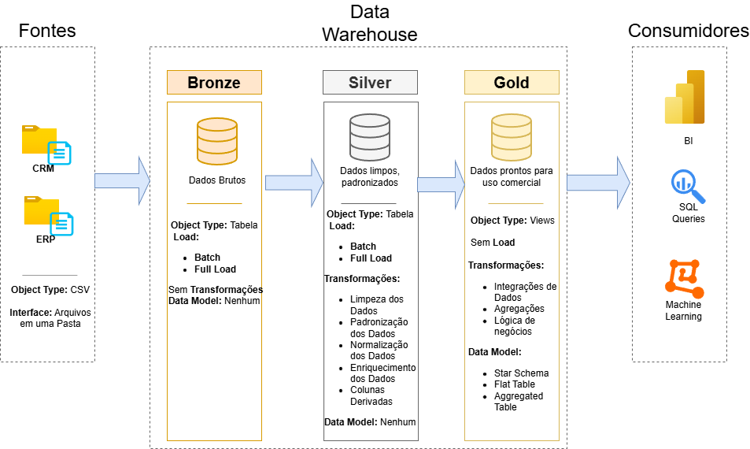

# Data Warehouse and Analytics Project

Bem vindo ao **Projeto de Data Warehouse e Análise de Dados**!
Esse projeto é baseado no curso ministrado pelo canal [Data with Baara](https://www.youtube.com/watch?v=SSKVgrwhzus). Ele demonstra uma solução compreensiva de data warehouse e análise de dados, desde o processo de criação até a geração de insights. 

## 🏗️ Arquitetura dos Dados

A arquitetura de dados desse projeto segue a Medallion Architecture com as camadas **Bronze**, **Silver**, e **Gold**: 

1. **Camada Bronze**: Armazena os dados como estão dos sistemas fonte. Os dados são ingeridos de arquivos CSV para o SQL Server.
2. **Camada Silver**: Essa camada inclui processos de limpesa de dados, padronização e normalização dos dados para análise.
3. **Camada Gold**: Armazena dados preparados para o mercado no modelo star schema.

---
## 📖 Overview do Projeto

Esse projeto envolve:

1. **Arquitetura de Dados**: O desgine de uma arquitetura moderna utilizando as camadas **Bronze**, **Silver**, e **Gold**. 
2. **Pipelines ETL**: Extrair, transformar e carregar dados de sistemas fonte para o warehouse.
3. **Modelagem de Dados**: Desenvolver tabelas de dimensões e fatos otimizadas para queries de análise.
4. **Análise e Relatórios**: Criar reports baseados em SQL e dashboards para insights.

## 🛠️ Links importantes e ferramentas:

- **[Datasets](datasets/):** Acesso para o conjunto de dados do projeto (csv).
- **[SQL Server Express](https://www.microsoft.com/en-us/sql-server/sql-server-downloads):** Server peso leve para hospedar bancos de dados SQL.
- **[SQL Server Management Studio (SSMS)](https://learn.microsoft.com/en-us/sql/ssms/download-sql-server-management-studio-ssms?view=sql-server-ver16):** GUI para monitorar e interagir com bases de dados.
- **[DrawIO](https://www.drawio.com/):** Para criar arquiteturas de dados, modelos, flows e diagramas.
- **[Notion](https://www.notion.com/):** Aplicativo tudo-em-um para organização de projetos.

---

## 🚀 Requisitos do Projeto

### Desenvolvendo a Data Warehouse (Engenharia de Dados)

#### Objetivo
Desenvolver um data warehouse moderno usando o SQL Server para consolidar dados de vendas, permitindo a geração de relatórios analíticos e a tomada de decisões informadas.

#### Especificações
- **Fontes de Dados**: Importar dados de dois sistemas de origem (ERP e CRM) fornecidos como arquivos CSV.
- **Qualidade dos Dados**: Corrijir e resolver problemas de qualidade de dados antes da análise.
- **Integração**: Combinar ambas as fontes em um único modelo de dados fácil de usar, projetado para consultas analíticas.
- **Escopo**: Focar apenas no conjunto de dados mais recente; a historização dos dados não é necessária.
- **Documentação**: Fornecer documentação clara do modelo de dados para dar suporte tanto às partes interessadas do negócio quanto às equipes de análise.

---
